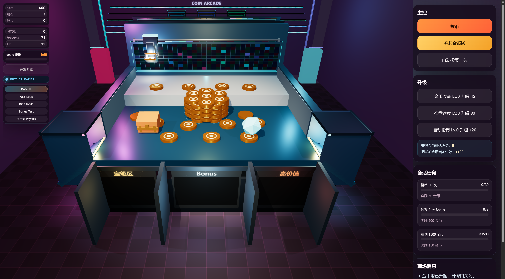
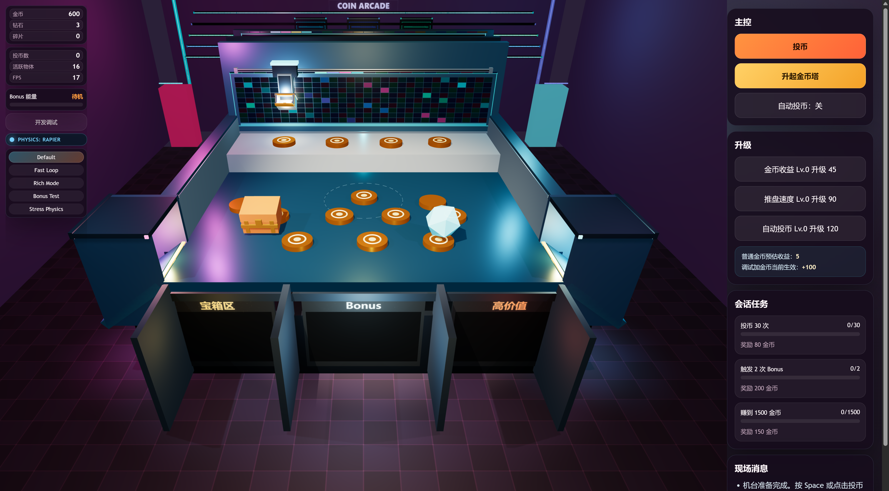

# Coin Pusher 3D

本项目是一个本地运行的 3D 推币机原型，基于 `Three.js + Rapier + Vite` 实现。

当前版本的目标不是接后端或做账号体系，而是先把以下能力跑通：

- 本地单机可玩
- 无登录
- 无持久化存储
- 经济和掉落逻辑可调
- 推盘、硬币、侧沿圆弧滑道、前方开口三槽具备基础物理和视觉反馈
- 给开发者保留快速调试入口





## 当前状态

已实现：

- 单层平整台面，后墙开口推盘往复
- 硬币、宝箱、稀有物掉落
- 前方三个开口坑洞（宝箱区 / Bonus / 高价值），中间隔板分流
- 左右侧沿用与台面相切的 90° 圆弧滑出
- 金币、钻石、碎片、任务、Bonus、Fever
- 开发调试面板和快捷键
- 台面中央圆形升降口与金币塔演出（`T` 或右侧按钮）
- 本地截图自测流程

当前仍然属于原型：

- 物理效果以“可玩、可调、可观察”为优先，不是严格工业级仿真
- 前方坑洞已改成开口下落，结算演出还偏轻
- 没有账号、存档、后端服务、广告、支付、埋点

## 技术栈

- `Three.js`：3D 场景、相机、灯光、材质
- `@dimforge/rapier3d-compat`：刚体、碰撞、重力、CCD、运动学推盘
- `Vite`：本地开发和构建
- `TypeScript`：原型逻辑组织

可选实验：在地址后加 `?physics=taichi` 可启用 Taichi 辅助；默认仍是 Rapier。

## 启动方式

先安装依赖：

```bash
pnpm install
```

本地开发：

```bash
pnpm dev
```

默认访问地址：

```text
http://127.0.0.1:4173/
```

生产构建：

```bash
pnpm build
```

本地预览构建产物：

```bash
pnpm preview
```

注意：

- `dev` 和 `preview` 默认都绑定 `127.0.0.1:4173`
- 两个脚本不要同时启动，否则会端口冲突

## 玩法与操作

基础操作：

- 点击右侧 `投币`
- 或按键盘 `Space`
- 点击 `升起金币塔` 或按 `T`，从台面圆孔升起一塔金币
- 点击 `自动投币` 可开关自动投放
- 右侧可以升级金币收益、推盘速度、自动投币

调试面板：

- 点击左上角 `开发调试`
- 或按 `F1`

预设切换快捷键：

- `1`：Default
- `2`：Fast Loop
- `3`：Rich Mode
- `4`：Bonus Test
- `5`：Stress Physics

开发快捷键：

- `G`：注入一档金币
- `H`：注入大额金币
- `J / K`：降低 / 提高推盘速度倍率
- `U / I`：降低 / 提高金币量级倍率
- `B`：强制触发 Bonus
- `A`：切换自动投币
- `R`：重置会话

## 调试能力

项目保留了开发者调试口子，便于快速校验物理、数值和节奏：

- 调试预设：`Default`、`Fast Loop`、`Rich Mode`、`Bonus Test`、`Stress Physics`
- 调试滑杆：
  - 时间倍率
  - 推盘速度倍率
  - 投币速度倍率
  - 金币量级倍率
  - 奖励结算倍率
  - Bonus 充能倍率
- 调试动作：
  - 快速加金币
  - 强制 Bonus
  - 清理低价值物体
  - 重置会话
  - 恢复默认调试值

浏览器控制台里还暴露了两个全局调试入口：

- `window.__coinPusherApp`
- `window.__coinPusherDebugState()`

## 项目结构

```text
src/
  main.ts                     入口
  styles.css                  页面和面板样式
  prototype/
    CoinPusherApp.ts          3D 场景、机台、玩法主循环
    config.ts                 基础数值、预设、初始状态
    types.ts                  类型定义
    ui.ts                     DOM UI 结构
    physics/RapierWorld.ts    Rapier 物理适配
    TaichiHybridPhysics.ts    可选 Taichi 辅助

artifacts/
  review-shot-*.png           本地截图自测结果

prototype-dev-notes.md
planning-wiki.md
rapier-migration-todo.md
coin-pusher-prd-v0.1.md
coin-pusher-tech-solution-v0.1.md
coin-pusher-local-framework-doc.md
```

说明：

- 当前实际运行入口在 `src/`，机台布局和玩法细节见 [prototype-dev-notes.md](prototype-dev-notes.md)
- `assets/scripts/` 下还有一套框架化脚本草图，现阶段不是 Vite 原型的运行入口
- `coin-pusher-prd-v0.1.md` 和 `coin-pusher-tech-solution-v0.1.md` 是更早的产品/技术方案，按 Cocos 方向写，不代表当前可运行原型

## 运行机制概览

核心循环在 `CoinPusherApp` 中完成：

1. 初始化 Three.js 场景、相机、灯光和机台结构
2. 初始化 Rapier 物理世界与接触参数
3. 生成初始硬币和奖励物
4. 每帧执行：
   - 自动投币更新
   - 推盘位置更新
   - 物理步进
   - 下层滑移辅助
   - mesh 与 body 同步
   - 奖励判定与回收
   - UI 状态刷新

## 设计约束

当前版本明确遵循以下约束：

- 只做本地运行
- 不接登录系统
- 不做持久化存储
- 会话数据只保存在内存
- 优先保证原型可调试、可观察、可快速迭代

## 已知限制

- 视觉表现已经从“占位原型”推进到“可演示原型”，但仍未达到高保真商业美术水准
- 物理参数做过多轮调校，当前默认后端是 Rapier，Taichi 仅作为可选辅助
- 前方三槽是开口深坑，掉入后会继续下落，不会停在坑底
- 当前没有音效系统
- 当前没有移动端专项交互优化

## 自测

已执行过的本地验证包括：

- `pnpm build`
- 浏览器自动化截图
- 快速节奏预设下的掉落观察
- 推盘、硬币、奖励槽的可视检查

部分截图保存在：

- [artifacts/review-shot-coin-tower-hatch.png](artifacts/review-shot-coin-tower-hatch.png) — 圆形升降口闭合（虚线标记）
- [artifacts/review-shot-coin-tower-risen.png](artifacts/review-shot-coin-tower-risen.png) — 金币塔升起完成
- [artifacts/review-shot-coin-tower-closeup.png](artifacts/review-shot-coin-tower-closeup.png) — 金币塔近景
- [artifacts/review-shot-polished.png](artifacts/review-shot-polished.png)
- [artifacts/review-shot-fast-loop-tilt.png](artifacts/review-shot-fast-loop-tilt.png)
- [artifacts/review-shot-fast-loop-assist.png](artifacts/review-shot-fast-loop-assist.png)

## 后续建议

如果继续迭代，建议按这个顺序推进：

1. 视觉与模式：见 [planning-wiki.md](planning-wiki.md)（金币样式、机台换皮、游戏模式）
2. 增强前方开口槽的掉入演出、粒子和音效
3. 拆分更真实的硬币投放机构和出币通道
4. 抽离数值配置，支持更系统的策划调参
5. 再考虑是否引入存档或后端能力
