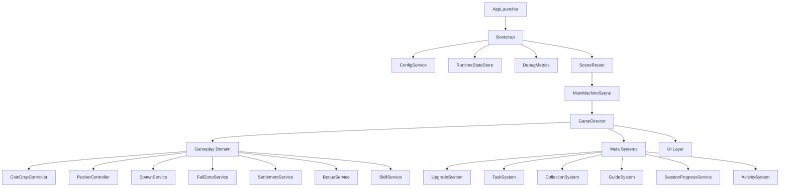
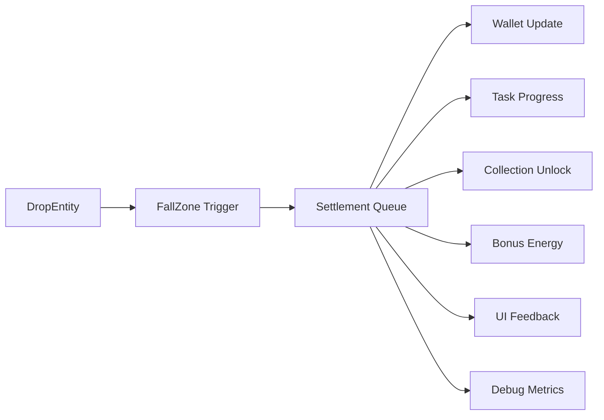

# 推金币游戏技术方案 v0.1

## 1. 文档信息

- 项目代号：Coin Pusher 3D
- 对应需求文档：`coin-pusher-prd-v0.1.md`
- 文档目标：将 PRD 收敛为可执行的技术实现方案
- 目标引擎：Cocos Creator 3.x 稳定版本
- 开发语言：TypeScript
- 当前运行形态：本地单机演示版
- 当前运行环境：Windows 本地运行 / Cocos Creator 编辑器预览
- 版本日期：2026-07-06
- 当前修订：本地单机运行，不接登录、不做持久化、不接广告和平台 SDK

## 2. 方案目标

本方案服务于 PRD 中定义的核心玩法目标，但当前阶段只面向本地单机演示版，优先解决以下问题：

- 跑通“投币 -> 推动 -> 掉落 -> 结算 -> 升级 -> 再投币”的完整闭环
- 让 3D 物理表现足够有爽感，但不过度追求完全真实
- 保证主要玩法参数、奖励结构、升级曲线可通过配置表调整
- 将工程复杂度压到最低，避免为暂不需要的平台能力提前设计
- 为后续主题机台、Bonus 扩展、活动系统预留结构

## 3. 范围与前提

### 3.1 本方案覆盖范围

- 1 个主机台场景
- 基础 3D 推台与掉落逻辑
- 普通金币、宝箱、稀有奖励物 3 类掉落物
- 1 套 Bonus 能量机制与 3 种基础 Bonus
- 投币、连投、基础自动投币
- 3 个主动技能
- 升级、任务、图鉴基础能力
- 内存态状态管理、本地桌面运行、调试面板

### 3.2 非目标

- 多人对战
- 大地图或复杂外部世界
- 高自由度机台编辑器
- 首版联网排行榜
- 广告、分享、审核模式、商业化点位

### 3.3 关键前提

- 当前仓库尚未初始化 Cocos Creator 工程，本方案按新建项目设计
- 当前阶段仅在本地 Windows 和 Cocos 编辑器中运行验证
- PRD 未明确横竖屏，本方案按桌面调试优先；UI 结构保留后续适配空间
- 当前阶段所有玩家进度仅保存在运行时内存中，关闭应用后重置
- 当前阶段不接入登录、广告、分享、审核和任何平台 SDK

## 4. 核心技术原则

- 配置驱动：掉落、奖励、升级、任务、Bonus、活动入口均由配置表控制
- 体验优先：物理结果允许“手感修正”，优先保证临界感、爆发感和正反馈
- 本地优先：先把单机玩法闭环做扎实，再考虑未来平台扩展
- 可调试性优先：关键状态、掉落、Bonus 和性能信息可在本地直接观察
- 调试覆盖隔离：开发者调试值通过 override 层生效，不直接污染基础配置
- 性能前置：从原型阶段就建立刚体预算、对象池和资源分包机制
- 可测试性优先：纯逻辑模块与表现模块解耦，数值与状态机可单测

## 5. 总体架构

### 5.1 分层结构



### 5.2 运行时流程

1. `AppLauncher` 启动并初始化日志、运行时状态、配置加载和调试能力
2. `Bootstrap` 完成调试开关、资源预热和主场景跳转
3. `SceneRouter` 进入主机台场景并实例化 `GameDirector`
4. `GameDirector` 统一管理玩法域、系统域、UI 域的生命周期
5. 玩家行为和掉落事件进入结算队列，再同步驱动任务、成长、图鉴和调试统计

### 5.3 场景拆分建议

- `BootScene`
  - 负责基础服务启动、资源预热、版本检查、跳转主场景
- `MainMachineScene`
  - MVP 主场景，包含机台、主 HUD、弹窗节点、引导节点、掉落表现
- `DebugScene`
  - 仅开发期使用，用于验证掉落、Bonus、性能与配置热切换

## 6. 工程目录建议

```text
assets/
  scripts/
    core/
      AppLauncher.ts
      GameDirector.ts
      EventBus.ts
      SceneRouter.ts
      StateMachine.ts
    gameplay/
      machine/
      drop/
      reward/
      bonus/
      skill/
      physics/
    systems/
      upgrade/
      task/
      collection/
      guide/
      session/
      activity/
    debug/
      DebugPanel.ts
      DebugMetrics.ts
      DebugCommands.ts
      DebugOverrideStore.ts
      DebugPresets.ts
    ui/
      hud/
      popup/
      guide/
      common/
    data/
      RuntimeStateStore.ts
      SessionStateFactory.ts
      StateSelectors.ts
      RuntimeCache.ts
    config/
      ConfigService.ts
      validators/
      schemas/
  resources/
    prefabs/
    materials/
    audio/
  bundles/
    machine-main/
    ui-common/
    audio-common/
    config-data/
```

## 7. 核心玩法实现方案

### 7.1 机台与推台系统

`PusherController` 负责机台推杆的周期运动，是整个爽感的核心驱动器。

实现要点：

- 推杆运动使用固定节奏曲线控制，而不是完全自由物理驱动
- 推进距离、速度、回退速度、停顿时间由 `MachineConfig` 配置
- 推杆运动状态对外广播，用于投币引导、技能触发和镜头强化
- 后续扩展主题机台时，仅替换机台配置和表现资源，不改核心逻辑

建议状态：

- `Idle`
- `Forward`
- `Hold`
- `Backward`

### 7.2 投币系统

`CoinDropController` 负责点击投币、长按连投、自动投币三种入口。

实现要点：

- 输入层只产生“投币请求”，真正生成物体由 `SpawnService` 统一处理
- 每次投币从可配置的落点范围中采样，避免绝对可控
- 长按连投和自动投币共用节流器，避免多入口叠加导致刷屏
- 投币成本、投币速度、连投速度、自动投币效率均走配置
- 新手期支持轻度保底逻辑，确保首次数次投币更容易触发正反馈

推荐处理链路：

```text
输入请求 -> 前置校验 -> 消耗货币/免费次数 -> 生成掉落物 -> 更新 HUD 与调试统计
```

### 7.3 掉落物与对象池

掉落物统一抽象为 `DropEntity`，按类型挂接不同表现和奖励定义。

MVP 类型：

- 普通金币
- 宝箱
- 稀有奖励物

实现要点：

- 所有掉落物必须使用对象池，避免频繁实例化
- 碰撞体优先使用简化形状，普通金币不使用高精度网格碰撞
- 生成时写入 `itemId`、`rewardType`、`rewardValue`、`sourceType`
- 掉落物进入结算区后立即标记为“已结算”，避免重复发奖
- 长时间静止且价值较低的物体可进入睡眠态，减少物理压力

### 7.4 掉落判定与结算

`FallZoneService` 负责检测物体进入不同区域，`SettlementService` 负责发奖、播表现并更新运行时状态。

区域建议：

- 普通回收区
- 高价值区
- 事件槽
- 宝箱区

实现要点：

- 碰撞判定与奖励发放分帧处理，避免同帧重复触发
- 发奖使用队列批处理，支持多物体连续掉落时的合并表现
- 结算后同步驱动：
  - 钱包数值
  - 任务进度
  - 图鉴解锁
  - Bonus 能量
  - 调试统计

推荐数据流：



### 7.5 Bonus 系统

`BonusService` 负责 Bonus 能量积累、触发条件判断、Bonus 状态切换和表现调度。

推荐状态机：

- `Idle`
- `Charging`
- `Ready`
- `Triggering`
- `Cooldown`

MVP 触发源：

- Bonus 槽掉入
- 短时间连锁掉落
- 稀有事件直触发

MVP Bonus：

- 金币暴雨 Bonus
- Fever 倍率 Bonus
- 宝箱空投 Bonus

实现策略：

- Bonus 定义为“配置 + 处理器”的组合
- `BonusConfig` 只描述门槛、持续时间、表现资源、基础倍率
- 具体执行逻辑由 `IBonusHandler` 实现，便于后续加新类型
- Bonus 期间所有收益修正统一走 `RewardModifierPipeline`，避免散落在各处判断

### 7.6 技能系统

技能系统设计为主动释放能力，统一由 `SkillService` 管理冷却、库存和效果应用。

MVP 技能：

- 强力推杆
- 磁吸回收
- 金币暴雨

实现要点：

- 技能 UI 只发送“释放技能”事件，不直接改玩法状态
- 技能效果以临时 Buff 或一次性动作两类实现
- 技能来源统一接到奖励系统和调试入口，避免多处发放逻辑分散
- 技能释放记录到调试统计，便于验证平衡性和使用频率

### 7.7 成长、任务、图鉴与运行时进度

这部分系统尽量做成纯逻辑模块，不直接依赖场景节点。

实现策略：

- `UpgradeSystem`：处理升级消耗、等级解锁、效果回写
- `TaskSystem`：监听统一事件总线，根据条件增量推进任务
- `CollectionSystem`：记录已解锁物品、主题外观和碎片进度
- `GuideSystem`：通过步骤状态机控制新手引导与保底逻辑
- `SessionProgressService`：统一维护钱包、升级、任务和局内标记的内存态快照
- `ActivitySystem`：MVP 仅提供入口和定时配置，不做复杂活动逻辑

说明：

- 当前阶段不实现签到系统，待持久化存储引入后再补跨日能力
- 当前阶段任务以会话内任务和成长验证为主，不依赖跨会话刷新

## 8. 数据与配置设计

### 8.1 配置表建议

| 配置表 | 作用 | 关键字段 |
| --- | --- | --- |
| `machine.json` | 机台参数 | 推杆节奏、摩擦表现、掉落权重、相机参数 |
| `item.json` | 掉落物定义 | 类型、奖励类型、奖励值、碰撞规格、表现资源 |
| `drop_table.json` | 掉落池权重 | 机台 ID、物品 ID、权重、刷新阶段 |
| `bonus.json` | Bonus 定义 | 触发门槛、持续时间、倍率、表现资源 |
| `skill.json` | 技能定义 | 类型、效果参数、持续时间、来源规则 |
| `upgrade.json` | 升级曲线 | 等级、消耗、收益倍率、解锁条件 |
| `task.json` | 任务配置 | 任务类型、目标值、奖励、刷新规则 |
| `guide.json` | 新手引导步骤 | 步骤 ID、触发条件、保底开关、UI 指引 |
| `app.json` | 本地运行开关 | 调试开关、面板入口、默认资源、性能等级、演示参数 |
| `debug_presets.json` | 调试预设 | 时间倍率、推杆倍率、金币倍率、奖励倍率、起始资源 |
| `audio.json` | 音频映射 | 事件 ID、音效资源、音量组 |

建议使用“表格源文件导出 JSON”的流程，程序只消费导出结果，不直接依赖手工维护的脚本常量。

### 8.2 运行时状态结构建议

```ts
interface RuntimePlayerState {
  sessionId: string;
  startTime: number;
  wallet: {
    coin: number;
    diamond: number;
    eventToken: number;
  };
  upgrades: Record<string, number>;
  inventory: Record<string, number>;
  skills: {
    owned: Record<string, number>;
    cooldownUntil: Record<string, number>;
  };
  collections: {
    unlockedItems: string[];
    unlockedThemes: string[];
    fragmentCount: Record<string, number>;
  };
  tasks: {
    session: Record<string, number>;
    achievement: Record<string, number>;
    claimed: string[];
  };
  guide: {
    currentStep: string;
    completedSteps: string[];
  };
  runtimeFlags: {
    tutorialGuaranteedDropUsed: boolean;
    autoDropEnabled: boolean;
    currentBonusId?: string;
  };
  settings: {
    bgmVolume: number;
    sfxVolume: number;
    vibration: boolean;
  };
}
```

运行时状态要求：

- 仅保存在内存中，应用关闭或重开后重置
- `RuntimeStateStore` 作为唯一可信数据源，UI 通过事件或选择器读取
- 字段命名尽量向未来持久化结构靠拢，后续补存档时减少重构成本

## 9. 本地运行方案

### 9.1 运行时组件

当前阶段不单独设计平台适配层，保留最小运行时组件即可：

- `RuntimeStateStore`
- `DebugMetrics`
- `DebugPanel`
- `SceneRouter`

### 9.2 本地运行行为

- 支持在 Cocos Creator 编辑器中直接预览主场景
- 支持在本地 Windows 构建后运行单机演示版
- 所有调试能力通过面板开关完成，不依赖第三方 SDK
- 外部能力默认只保留窗口焦点、键鼠输入和本地日志输出

### 9.3 界面开关范围

- 调试按钮是否显示
- 是否展示性能统计
- 是否开启保底掉落
- 是否开放快速加资源按钮

所有 UI 显隐必须来自本地配置或调试开关，不允许散落在各页面写硬编码判断。

### 9.4 开发者调试入口

建议保留一个只在开发模式启用的调试入口，用来快速验证手感、数值和性能边界。

推荐入口：

- 键盘 `F1` 打开或关闭调试面板
- 键盘 `` ` `` 快速展开精简调试条
- 编辑器模式默认显示调试按钮
- 构建版仅在 `app.json` 中开启 `debugEnabled` 时可见

推荐链路：

```text
DebugPanel -> DebugCommands -> DebugOverrideStore / RuntimeStateStore -> Gameplay Systems
```

设计要求：

- 基础配置只读，调试参数统一写入 `DebugOverrideStore`
- 调试覆盖优先级高于配置表，低于硬性安全钳制
- 所有调试修改都支持“一键恢复默认”
- 调试能力区分“状态注入”和“参数覆盖”两类，避免混用

建议暴露的调试项：

- 时间倍率：`timeScale`
- 推杆速度倍率：`pusherSpeedScale`
- 投币速度倍率：`dropIntervalScale`
- 自动投币速度倍率：`autoDropRateScale`
- 金币价值倍率：`coinValueScale`
- 奖励结算倍率：`rewardMultiplier`
- Bonus 充能倍率：`bonusChargeScale`
- 初始金币数量：`startingCoinAmount`
- 当前会话加金币：`addCoin`
- 当前会话加钻石：`addDiamond`
- 强制触发 Bonus：`forceBonus`
- 强制生成宝箱或稀有物：`spawnDebugItem`
- 清空低价值掉落物：`clearLowValueDrops`
- 重置当前会话状态：`resetSession`

建议预设：

- `default`：正常体验参数
- `fast_loop`：提升推杆速度和投币效率，快速验证闭环
- `rich_mode`：提高金币量级和奖励倍率，验证升级与成长节奏
- `bonus_test`：提高 Bonus 充能和触发频率，验证爆点表现
- `stress_physics`：提高投币密度，验证刚体预算和对象池

## 10. 性能与资源策略

### 10.1 性能目标

- 首次启动到首枚金币投放时间小于 15 秒
- 本地开发机和编辑器预览下主场景稳定运行，无明显持续掉帧
- 本地构建版在连续投币和 Bonus 触发下保持可玩

### 10.2 关键策略

- 严格使用对象池管理金币、宝箱、特效、飘字
- 控制同时活跃的动态刚体数量
- 低价值、长时间静止物体及时休眠
- 优先使用基础碰撞体，避免复杂网格碰撞
- 将高频掉落特效做成可降级表现
- 资源按场景和功能分包，主场景只预热必要资源
- 音频分组管理，防止大量碰撞音叠加失控

### 10.3 建议预算

以下为原型阶段建议预算，最终以实机测试为准：

- 本地原型动态刚体预算：`80 ~ 120`
- 主场景首屏仅加载主机台、HUD、基础掉落资源
- 稀有 Bonus 表现资源按需异步加载

### 10.4 包体与加载策略

- `config-data` 独立 bundle，优先加载
- `machine-main` 存放主机台模型与材质
- `ui-common` 存放通用 HUD、弹窗、引导资源
- `audio-common` 单独分包并支持延迟预热
- 非首局必需资源在首轮游戏后后台加载

## 11. 调试与观测体系

### 11.1 关键调试事件

- `session_start`
- `session_end`
- `tutorial_step`
- `coin_drop`
- `drop_reward`
- `bonus_charge`
- `bonus_trigger`
- `skill_use`
- `upgrade_buy`
- `task_claim`
- `fps_sample`
- `rigidbody_peak`

### 11.2 开发者调试项清单

建议将调试项分为 3 组，避免面板失控：

- 节奏组：`timeScale`、`pusherSpeedScale`、`dropIntervalScale`、`autoDropRateScale`
- 经济组：`coinValueScale`、`rewardMultiplier`、`startingCoinAmount`、`addCoin`
- 事件组：`bonusChargeScale`、`forceBonus`、`spawnDebugItem`、`clearLowValueDrops`

其中最重要的两个口子：

- 速度口子：允许快速拉高推杆速度、投币频率和整体时间倍率，用于验证爽感区间
- 金币量级口子：允许快速放大起始金币、单次奖励和升级收益，用于验证成长曲线

### 11.3 调试值生效规则

为避免调试导致逻辑失真，建议按以下顺序计算运行值：

```text
BaseConfig -> DebugOverride -> SafetyClamp -> RuntimeValue
```

示例：

- 推杆最终速度 = `MachineConfig.baseSpeed * pusherSpeedScale`
- 投币最终间隔 = `CoinConfig.baseInterval / dropIntervalScale`
- 奖励最终金币 = `baseReward * coinValueScale * rewardMultiplier`
- Bonus 最终充能 = `baseCharge * bonusChargeScale`

建议安全钳制范围：

- `timeScale`：`0.5 ~ 4.0`
- `pusherSpeedScale`：`0.5 ~ 3.0`
- `dropIntervalScale`：`0.5 ~ 5.0`
- `coinValueScale`：`0.1 ~ 100`
- `rewardMultiplier`：`0.1 ~ 20`
- `bonusChargeScale`：`0.1 ~ 10`

### 11.4 本地验证指标

当前阶段不接入外部分析平台，核心指标通过本地日志和调试面板观察：

- 新手引导完成率：由 `tutorial_step` 与 `session_end` 计算
- 首局完成率：由首局结算事件计算
- 平均单次会话时长：由 `session_start/session_end` 计算
- 人均 Bonus 触发次数：由 `bonus_trigger` 统计
- 升级系统使用率：由 `upgrade_buy` 统计
- 峰值物理压力：由 `rigidbody_peak` 统计

## 12. 开发阶段建议

### 12.1 阶段 1：原型验证

目标：

- 跑通投币、推台、掉落、结算最小闭环
- 验证推杆节奏、落点范围、掉落爽感
- 实测刚体预算和资源加载方式

交付：

- `MainMachineScene` 原型
- `CoinDropController`
- `PusherController`
- `FallZoneService`
- 调试面板和性能统计
- 调试覆盖层与调试预设

### 12.2 阶段 2：MVP 开发

目标：

- 接入升级、任务、图鉴
- 落地 Bonus、技能、内存态状态容器
- 打通编辑器预览和本地 Windows 构建

交付：

- 全量系统模块
- 配置表加载和校验
- 主 HUD 与核心弹窗
- 本地调试工具
- 调试参数热更新能力

### 12.3 阶段 3：测试与调优

目标：

- 调整掉落频率、奖励反馈、Bonus 触发密度
- 压测连续投币和低端设备表现
- 校验长时间本地运行下状态和性能是否稳定

交付：

- 性能报告
- 数值调优记录
- Bug 清单与修复版本

### 12.4 阶段 4：首发准备

目标：

- 完成本地演示版打包和参数冻结
- 复核版本信息、默认配置和调试入口
- 输出可交付的本地构建产物

## 13. 测试策略

### 13.1 逻辑测试

适合写成纯 TypeScript 单测的模块：

- 升级价格与收益计算
- Bonus 能量积累和触发门槛
- 任务进度计算
- 奖励结算与倍率修正
- 运行时状态初始化与重置
- 调试覆盖优先级与安全钳制

### 13.2 场景回归测试

重点验证：

- 首局 20 秒内能否稳定出现正反馈
- 连投与自动投币是否会击穿刚体预算
- 多掉落连续结算是否重复发奖
- Bonus 触发频率是否落在 PRD 预期区间
- 调试开关开闭后 UI 和状态是否正确变化
- 调高速度倍率和金币量级后系统是否仍然稳定

### 13.3 调试工具建议

- 开发面板支持手动加金币、触发 Bonus、跳过引导、强制掉落
- 显示当前活跃刚体数、对象池使用率、FPS、内存估计
- 支持快速重置会话状态和切换性能等级
- 支持保存和切换调试预设，便于反复复现问题

## 14. 主要风险与应对

| 风险 | 表现 | 应对方案 |
| --- | --- | --- |
| 物理对象过多导致卡顿 | 连投后帧率骤降 | 对象池、刚体预算、休眠与表现降级 |
| 真实物理过强导致结果失控 | 物品长期卡边或收益波动过大 | 用配置修正推杆节奏、落点范围、掉落权重 |
| 为未来能力过度设计 | 当前项目结构过重、开发变慢 | 本阶段只保留本地运行必需组件 |
| 数值调整成本过高 | 每次调优都要改代码 | 所有关键参数配置化并做校验 |
| 首局体验不稳定 | 玩家前几次投币没有爽点 | 新手保底、首局掉落调优、轻量 Bonus 演示 |
| 无持久化导致重开后进度清零 | 长线成长和跨日体验暂不可验证 | 原型阶段接受该限制，待核心玩法稳定后补持久化 |
| 本地环境差异影响调试结果 | 编辑器预览和构建版表现不一致 | 关键性能和手感同时在编辑器与构建版验证 |

## 15. 结论

该方案建议以“配置驱动的核心玩法层 + 运行时状态层 + 轻量系统层”作为项目主结构，先在本地原型阶段把投币、推动、掉落和结算做透，再逐步接入成长、任务和桌面构建能力。

如果按此方案推进，项目能够满足 PRD 对 MVP 的三个关键要求：

- 有足够强的 3D 掉落爽感
- 可通过配置持续调优与扩展
- 能以较低复杂度完成本地单机演示和后续扩展准备
